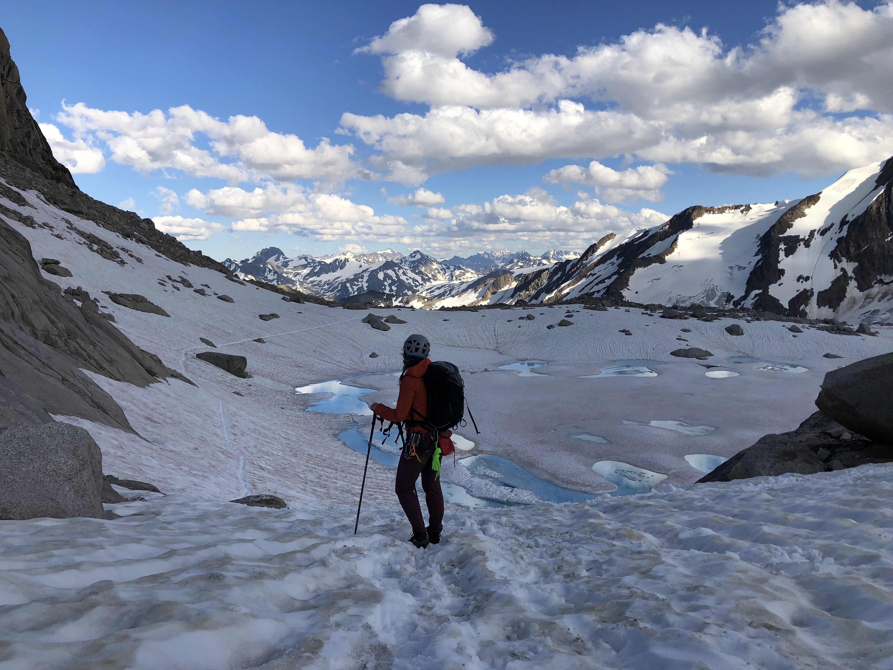

<style type="text/css">
.main-container {
  max-width: 1800px;
  margin-left: auto;
  margin-right: auto;
}
</style>


## [HOME](http://mattols.github.io/) | 

<div style= "float:right;position: relative;top:10px">
```{r, out.width = "300px",echo=FALSE}

```
</div>

<style>
div.gray { background-color:#165806; border-radius: 5px; padding: 20px;}
</style>
<div class = "gray">


# **Spatial Data & Problem Solving in the Earth Sciences**{#top}
Utah Valley University - Geography


## Handy links:

#### [Course Syllabus](https://mattols.github.io){target="_blank"}

#### Course [file repository](https://github.com/"}

#### R for Data Science [Website](https://r4ds.had.co.nz/){target="_blank"}
  
#### Amy Willis' Intro to R [course](https://github.com/adw96/biost509){target="_blank"} 
(for related alternative exercises/lessons)

#### Big Book of R [collection of free R books](https://www.bigbookofr.com/){target="_blank"} ...Whoa!

#### Spatial Data Links

___


<style>
div.blue { background-color:#a89d82; border-radius: 5px; padding: 20px;}
</style>
<div class = "blue">

## The Command Line, File Paths, Git
<div style= "float:right;position: relative;top:10px">
```{r, out.width = "250px",echo=FALSE}

```
</div>

### **Week 1**{#Week-1}
**Topics:** 

  - Installing Software | Command-line | Git version control 

**Assignments**  

  - Read: [What is Git all about?](https://peerj.com/preprints/3159/)
  - Install Git, R, and R-Studio on your laptop (part of Assignment 1)
  - Be ready to explain what Git, R, and R-Studio are.
  - Do [Assignment 1](https://mattols.github.io/){target="_blank"} and upload a link to your new GitHub account to Canvas.
  - Take a look at [this document](https://mattols.github.io/){target="_blank"} to see where this class is going
  - Go through ALL the resources below. I put them here for a reason. Most are short web resources or videos (some that I made).

**Resources**

  - Video: Meet the [command line](https://youtu.be/cg115YYQYgc){target="_blank"} of your computer
  - [Download Git](https://git-scm.com/downloads){target="_blank"}
  - [Download R](https://cran.cnr.berkeley.edu/){target="_blank"}
  - [Download R-Studio](https://rstudio.com/products/rstudio/download/#download){target="_blank"}
  - [Navigating with the command line](https://computers.tutsplus.com/tutorials/navigating-the-terminal-a-gentle-introduction--mac-3855){target="_blank"} (great video!)
  - [Setting up 2FA for GitHub](https://docs.github.com/en/github/authenticating-to-github/securing-your-account-with-two-factor-authentication-2fa){target="_blank"}
  - GitHub steps for Assignment 1 [video](https://youtu.be/M9430_eGttI){target="_blank"}
  - [Git Cheat Sheet](https://www.atlassian.com/git/tutorials/atlassian-git-cheatsheet){target="_blank"} (handy reference)
  - [Git tutorial](https://product.hubspot.com/blog/git-and-github-tutorial-for-beginners){target="_blank"} for beginners (another walkthrough, if you need it)
  - Best [Git Cheat Sheet Ever!](https://remembertheapi.com/products/git-cheat-sheet-black-mug-11oz){target="_blank"} (Excellent gift idea for a teacher...joking!)
  

**Practice**

  - Make 10 more separate changes and commits to your README.md file and push each one to GitHub 
  - Close and open your command line terminal 10 times
  - Open your command line terminal and navigate to your new personal GitHub repository for this course (Data_Course_LASTNAME) / Navigate back to your desktop / From your Desktop (without using "cd") display the contents of Data_Course_LASTNAME/README.md onto your computer screen.
  - Please view this short [video clip](https://gzahn.github.io/data-course/media/paint_the_fence.mp4){target="_blank"} from "Karate Kid" (Seriously)
    + When I tell you to close and open your command line 10 times, it's not because I hate you.
    + It's because I, too, have had to learn this stuff from scratch
    + It's because I know that repetition is crucial to learning this, especially at the beginning
    + And it's because if you don't spend the time to do this stuff over and over now, by week 6 you will be drowning and helpless.
    + When I say "push 10 separate commits to your GitHub repo," what I'm actually saying is "Show me 'Paint the Fence'!"
    + Because very soon, Mr. Miyagi will be attacking you with things like "Error in url[i] = paste(df[,2], gsub(" ", "_",  : 
  object of type 'closure' is not subsettable"

[Back to top of page](#top)

___

<div style= "float:right;position: relative;top:10px">
```{r, out.width = "350px",echo=FALSE}

```
</div>